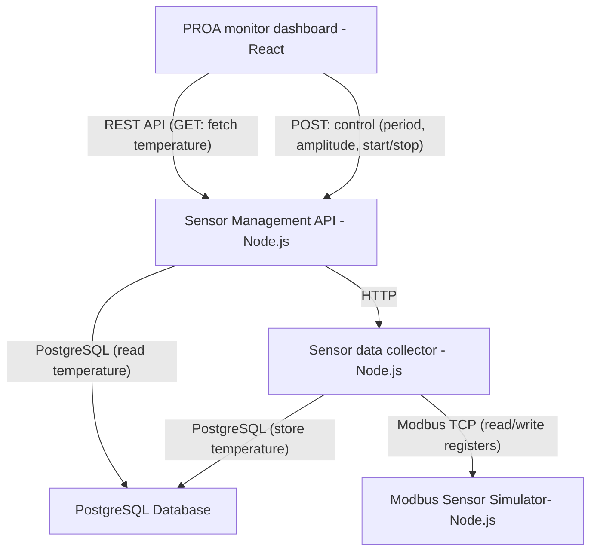
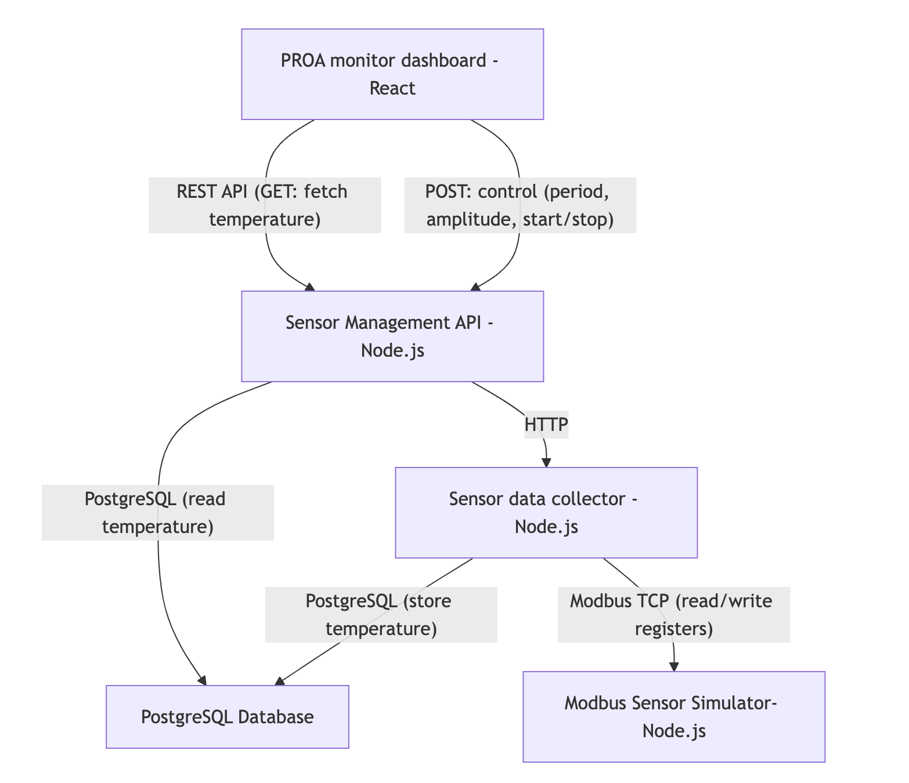

# System Design: PROA SENSOR MONITOR

## Overview

This system simulates a Modbus temperature sensor, enables real-time data read, stores sensor data in PostgreSQL, and provides a React.js frontend for visualization and interaction. All backend services are implemented in Node.js/TypeScript.

## Architecture Diagram (Mermaid)

Here is the diagram which use Mermaid

Here is the screenshot for architecture diagram
